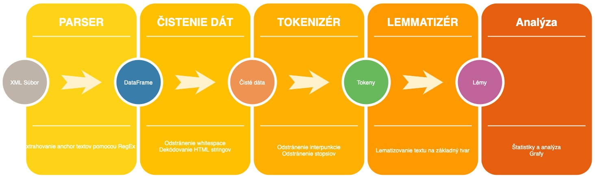

# CZWiki - Lematizer, Stemmer založený na anchor textoch

## Motivácia 

Úspešné vypracovanie zadania obnáša lematizovanie a stemmovanie linkov na českej wikipédií. Linky sú označené ako anchor texty, a budeme pracovať s textami v ich vnútri.

## Návrh riešenia

Celý dátový súbor preparsujeme pomocou Regulárnych výrazov a ęxtrahujeme z neho anchor linky a texty do DataFramu v Pythone.

Po vytiahnutí datasetu očistíme dáta - whitespace, preparsujeme HTML encoded string na klasický string a pod.

Následne dataset pretransformuje cez tokenizér, ktorý nam odstráni stopslová a interpunkciu a daný dataset ešte pretransformujeme pomocou lemantizéru.
Tokenizér využijem z python knižnice nltk a lemmatizér českého jazyka [Majka](https://nlp.fi.muni.cz/czech-morphology-analyser) 

Výsledkom práce bude dataframe s pretransformovanými slovami na základe ktorých budeme môcť vytvárať rozličné štatistiky a analýzy.

Riesenie planujem vypracovat v grafickom rozsireni pythonu s nazvom Jupyter Notebook, v ktorom je mozne vizualizovat statistiky a analyz pomocou grafov.
K praci s dataframom budem vyuzivat python kniznice `pandas`, `scikit learn`, `numpy`.

#### Diagram architektúry


#### Pseudokód

```python
funkcia parsuj(data):
    dataset = []
    pre kazdy riadok(data):
        ak zhoda = riadok.match(RegexAnchoru):
            dataset.pridaj(zhoda)
    return dataset
    
funkcia cisti(dataframe):
    pre kazdy zaznam(dataframe):
        dataframe.zaznam = ostran_whitespace(zaznam).decodeHTMLString()
    return dataframe     
    
funkcia tokenizuj(dataframe):
    pre kazdy zaznam(dataframe):
        dataframe.zaznam = odstran_interpunkciu(zaznam)
        dataframe.zaznam = odstran_stopslova(zaznam)
    return dataframe

funkcia lemmatizuj(df):
    pre kazdy zaznam(dataframe):
        dataframe.zaznam = Lemmatizer.lemmatize(zaznam)
    return dataframe
    
df = parsuj(subor.xml)
df = cisti(df)
df = tokenizuj(df)
df = lemmatizuj(df)    
```

## Súčasné riešenia

TBA: prehľad súčasných riešení daného problému - existujúci softvér, algoritmy, vedecké články, linky (0,5 strany)

## Vypracovanie 

TBA: popis riešenia, použitý softvér, použité existujúce riešenia, popis problémov ktoré sa vyskytli, popis prác na projekte (1 strana)

## Dataset

Na oficiálnej stránke wikipédie  [[https://dumps.wikimedia.org/cswiki/latest/|https://dumps.wikimedia.org/cswiki/latest/]] sme z dumpov stiahli archív dát s názvom [[https://dumps.wikimedia.org/cswiki/latest/cswiki-latest-pages-articles.xml.bz2|cswiki-latest-pages-articles.xml.bz2]]. Rozbalené dáta obsahovali XML súbor s danými stránkami a podstránkami wikipédie.

Root elementom daného XML súboru je tag `mediawiki`. 
Ten obsahuje element `siteinfo` a množstvo elementov typu `page`, ktoré majú každý svoj `title`, `id`, `revision`.

Nás budú hlavne zaujímať práve posledné, `revision`. Tento element obsahuje poslednú revíziu - verziu danej stránky. V prípade, že by sme stiahli dump s kompletnou históriou, tých tagov `revision` vrámci tagu `page` by bolo viac.

Každá revízia obsahuje element `text`. V danom elemente sa nachádza kompletný text v syntaxi [Wikitext](https://en.wikipedia.org/wiki/Help:Wikitext).
V tejto syntaxi sa anchor (kotvy) oznacuju zaciatok -  `[[` a koniec - `]]`. 

V anchore sa mozu nachadzat dva texty - prvy je cesta (ci uz absolutna alebo relativna), a text danej kotvy. Tieto dva texty su oddelene znakom `|`. Preto nas bude zaujimat text za tymto znakom.
V pripade ze dany anchor obsahuje len text, ktory sa zhoduje s cestou, anchor neobsahuje znak `|` a 
musime teda vyparsovat cely text.
 
Dany text vyzera byt este zakodovany ako html string - cize napr. znaky `"` su oznacene ako `&quot;`. Toto bude treba preparsovat.

Na extrahovanie anchorov teda pouzijeme RegEx, matchneme vsetok obsah medzi znackami `[[` a `]]`.

#### Sample data:

```xml
<mediawiki xmlns="http:`www.mediawiki.org/xml/export-0.10/" xmlns:xsi="http:`www.w3.org/2001/XMLSchema-instance" xsi:schemaLocation="http:`www.mediawiki.org/xml/export-0.10/ http:`//`www.mediawiki.org/xml/export-0.10.xsd" version="0.10" xml:lang="cs">\
  <siteinfo>
  ...
   </siteinfo>
  <page>
  <page>
    ...
    <revision>
      ...
      <text ... >
'''Červenka''' ({{Vjazyce|de}} ''Schwarzbach bei Olmütz'') je [[obec]] v [[Olomoucký kraj|Olomouckém kraji]], 
18&amp;nbsp;km severozápadně od [[Olomouc]]e a 3 km severně od [[Litovel|Litovle]]. 
Leží na levém břehu potoka Čerlinky, který se u [[Tři Dvory (Litovel)|Tří Dvorů]] 
vlévá do bývalého ramene řeky [[Morava (řeka)|Morava]]. 
Žije zde {{Počet obyvatel}} obyvatel.
== Historie =
      </text>
    </revision>
  </page>
</mediawiki>
```


## Vyhodnotenie 

TBA: vyhodnotenie slovné subjektívne na nejakých konkrétnych príkladoch. Vo vačšine projektov aj vyhodnotenie pomocou presnosti a pokrytia (precision a recall) (0,5-1 strana)

## Použitie
TBA: spustenie, inštalácia softvéru, použitie softvéru. (0,5-1 strana)
